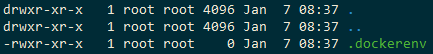

# Linux 帳號設定調研

用戶管理 ( 或稱帳號管理 ) 是任何授權系統 ( 非開放式服務 ) 的基礎設計，因此，了解一個系統的帳號管理服務也能同時了解受到整個系統的核心運作邏輯。

## 用戶 ( User )

在 Linux 系統中，一個用戶包括兩個數據：

+ 用戶 ( User ID、UID )
    - ```useradd``` ：建立用戶
    - ```passwd``` ：設定用戶密碼
    - ```usermod``` ：修改用戶資料
    - ```userdel``` ：刪除用戶
+ 群組 ( Group ID、GID )
    - ```groupadd``` ：建立群組
    - ```gpasswd``` ：管理群組
    - ```groupmod``` ：修改群組資料
    - ```groupdel``` ：刪除群組

其數據有以下特性：

+ 用戶建立時，會同時建立一個用戶同樣名稱的群組
    - 用戶預設會建立一個家目錄 ```hoem/<user name>```，此目錄權限預設為用戶與群組皆為建立的用戶名稱
    - 用戶預設是無法登入帳號，若不透過設定用戶密碼，則該用戶無法切換、也無法登入
    - 用戶即使設瞭密碼也可以透過設定執行 ```/sbin/nologin``` 另其成為無法登入狀態
+ 在建立群組時，並不會同時產生一個同名的用戶
+ 用戶除了原始群組外，可以透過管理者加入其他群組
+ 群組可以不包括任何用戶

## 權限 ( Permission )

在 Linux 系統中，一切物件皆受有其權限資料，其資料結構如下：



```
-rwxr-xr-x.  1    root     root       0    Jan  7 08:37 .dockerenv
[    1    ][ 2 ][   3   ][   4   ][   5   ][     6    ][    7    ]
[   權限  ][連結][ 用戶 ][  群組 ][檔案容量][ 修改日期 ][  檔名   ]
```

第一欄中的 10 個字符，便是此物件的權限資料，其分別表示為：

```
<物件型態 (1)><用戶權限 (3)><群組權限 (3)><其他用戶權限 (3)>
```

+ 物件型態，此編碼是用來標示該物件的資料類型
    - ```-``` ：標示為檔案
    - ```d``` ：標示為目錄
    - ```l``` ：標示為連結 ( link )
    - ```b``` ：標示為裝置檔中可儲存周邊設備，如 USB 等動態存取設備
    - ```c``` ：標示為裝置檔中的序列埠設備，如鍵盤、滑鼠等一次性讀取設備
+ 用戶權限，此編碼是表示此物件擁有用戶的操作權限，分為讀取 ( ```r``` )、寫入 ( ```w``` )、執行 ( ```x``` )
+ 群組權限，此編碼是表示此物件擁有群組的操作權限，分為讀取 ( ```r``` )、寫入 ( ```w``` )、執行 ( ```x``` )
+ 其他用戶權限，此編碼是表示此物件對其他用戶的操作權限，分為讀取 ( ```r``` )、寫入 ( ```w``` )、執行 ( ```x``` )

第三攔、第四欄分別表示此物件的擁有用戶與群組，在此標記的用戶受用戶權限影響操作權，群組受群組權限影響，而不再群組內的其他用戶受其他用戶權限影響。

而對於物件的權限的調整，常用的指令如下：

+ ```chgrp``` ：改變檔案所屬群組
+ ```chown``` ：改變檔案擁有者
+ ```chmod``` ：改變檔案的權限

## Filesystem Hierarchy Standard

在 Linux 中，由於開源社群導致大量開發者同時協力開發，導致各開發者有著自己撰寫的習慣，因此影響了對於目錄的稱呼與用途規劃，對此社群提出了 Filesystem Hierarchy Standard ( FHS ) 來規範各常見目錄的用途與稱呼。

#### ```/``` 根目錄

| 目錄 | 放置內容 |
| :- | :---------- |
| ```/``` | 根目錄是整個系統最重要的一個目錄，因為不但所有的目錄都是由根目錄衍生出來的，同時根目錄也與開機、修復、還原等動作有關；因為根目錄是這麼的重要，所以在 FHS 建議，根目錄不要放在非常大的分割槽內，因為越大的分割槽妳會放入越多的資料，如此一來根目錄所在分割槽就可能會有較多發生錯誤的機會。|
| ```/bin``` | 放置執行檔的目錄，但因為```/bin```放置的是在單人維護模式下還能夠被操作的指令，且底下的指令可以被 root 與一般帳號所使用，因此系統常用指令都會儲存於此。|
| ```/boot``` | 這個目錄主要在放置開機會使用到的檔案，包括Linux核心檔案以及開機選單與開機所需設定檔等等。|
| ```/dev``` | 裝置掛載後的目錄，由於在Linux系統上，任何裝置與周邊設備都是以檔案的型態存在於這個目錄當中，因此可透過存取某個檔案來操作掛載裝置。|
| ```/etc``` | 系統主要的設定檔儲存目錄，例如人員的帳號密碼檔、 各種服務的啟始檔等等。由於此目錄修改會影響到整體系統，雖然一般人可查閱，但修改僅有 root 權限才可。|
| ```/lib``` | 系統或相關軟體執行時所需要的函式庫儲存目錄，例如編譯工具與軟體所需的動態函示庫。|
| ```/mnt``` | 若需暫時掛載某些額外的裝置，一般建議可以放置到這個目錄中。|
| ```/opt``` | 作業系統的第三方協力軟體儲存目錄，需注意這些第三方屬於作業系統的外部協助軟體，例如 KDE 軟體。|
| ```/sbin``` | 系統執行檔 ( system binary ) 存放目錄，這些指令常用於設定環境使用，主要運用於開機、修復、還原等操作相關；此目錄有別於 ```bin```，主要差別在是否提供給作業系統設定與操作相關。|
| ```/tmp``` | 一般用戶或者是正在執行的程序暫時放置檔案的地方，此目錄為任何人皆可存取。|
| ```/home``` | 用戶的家目錄 ( Home directory )，每個新增用戶皆會在此目錄建立家目錄。|
| ```/root``` | 系統管理員的家目錄 ( root directory )。|
| ```/usr``` | Unix 作業系統軟體資源 ( Unix Software Resource ) 的縮寫，任何可安裝於作業系統的軟體皆會儲存此目錄，詳細子目錄定義如後。 |
| ```/var``` | 作業系統與軟體動態產生的數據皆儲存於此，例如快取 ( cache )、登錄檔 ( log )，詳細子目錄定義如後。 |

以上整理的非全部 FHS 規範目錄，詳細可參考 [FHS 3.0 文件](https://refspecs.linuxfoundation.org/FHS_3.0/fhs-3.0.pdf)

#### ```/usr``` 目錄

| 目錄 | 放置內容 |
| :- | :---------- |
| ```/usr/bin``` | 用戶能夠使用的指令，依據不同作業系統會讓 ```/bin``` 連結一致。|
| ```/usr/lib``` | 用戶軟體所需的函示庫目錄，依據不同作業系統會讓 ```/lib``` 連結一致。 |
| ```/usr/local``` | 系統管理員在本機下載並安裝的軟體，建議安裝到此目錄。 |
| ```/usr/sbin``` | 非系統正常運作所需要的系統指令，，依據不同作業系統會讓 ```/sbin``` 連結一致。|
| ```/usr/share```| 放置唯讀架構的資料檔案，當然也包括共享文件。|

以上整理的非全部 FHS 規範目錄，詳細可參考 [FHS 3.0 文件](https://refspecs.linuxfoundation.org/FHS_3.0/fhs-3.0.pdf)

#### ```/var``` 目錄

| 目錄 | 放置內容 |
| :- | :---------- |
| ```/var/cache``` | 應用程式執行過程中會產生的暫存檔存放目錄。|
| ```/var/lib``` | 應用程式執行過程中需要使用到的資料檔案存放目錄。 |
| ```/var/log``` | 登錄檔存放目錄，如 ```/var/log/messages```、```/var/log/wtmp``` ( 記錄登入者的資訊 ) 。 |

以上整理的非全部 FHS 規範目錄，詳細可參考 [FHS 3.0 文件](https://refspecs.linuxfoundation.org/FHS_3.0/fhs-3.0.pdf)

## 設計項目

### 新增帳號

本項目執行指令 ```demo.bat 1```，主要[原始碼](./src/demo1.sh)

+ 建立一般用戶
    - 依據不同的作業系統，其預設會有差異，可以參考 ```adduser -D```
    - 在 Ubuntu 會強制不建立家目錄
    - 另外使用容器啟動的環境預設登入環境為 ```/bin/sh```，這部分可以替換

+ 建立系統用戶
    - 系統用戶預設就不會建立家目錄
    - 此段不設定初始群組，可以在群組中查詢到與用戶名相同的新群組

+ 修改密碼
    - 任何新建的用戶皆未設定密碼，在未設定的情況下將無法登入
    - 不同作業系統提供的無互動變更密碼，期方式並不相同
    - 在 CentOS 7+ 用 ```echo password | passwd --stdin username```
    - 在 Ubuntu 用 ```echo username:password | chpasswd```

+ 切換帳戶測試，在轉換至 testuser 時請輸入設定的密碼便於後續測試

### 用戶共管目錄

### 應用程式限定用戶

### 應用程式共管目錄

### SFTP 帳號設定

## 文獻

+ Linux 教學文獻
    - [第五章、Linux 的檔案權限與目錄配置](https://linux.vbird.org/linux_basic/centos7/0210filepermission.php)
    - [第六章、Linux 檔案與目錄管理](https://linux.vbird.org/linux_basic/centos7/0220filemanager.php)
    - [第十章、認識與學習BASH](https://linux.vbird.org/linux_basic/centos7/0320bash.php)
    - [第十三章、Linux 帳號管理與 ACL 權限設定](https://linux.vbird.org/linux_basic/centos7/0410accountmanager.php)
+ [OES 2018 SP2: Linux User Management Administration Guide](http://www.novell.com/documentation/open-enterprise-server-2018/acc_linux_svcs_lx/data/bookinfo.html)
    - [Unix / Linux - User Administration](https://www.tutorialspoint.com/unix/unix-user-administration.htm)
    - [第十三章、Linux 帳號管理與 ACL 權限設定](https://linux.vbird.org/linux_basic/centos7/0410accountmanager.php)
+ 帳號設定相關文獻
    - [How To Set or Change Linux User Password](Research for Linux OS account setting, focus on how to setting account for different usage.)
    - [Understanding /etc/shadow file format on Linux](https://www.cyberciti.biz/faq/understanding-etcshadow-file/)
    - [Where are the passwords of the users located in Linux?](https://www.cyberciti.biz/faq/where-are-the-passwords-of-the-users-located-in-linux/)
    - [How to Change User Password in Linux](https://linuxize.com/post/how-to-change-user-password-in-linux/)
    - [System Users and Human Users in Linux Explained with Examples](https://www.cyberithub.com/system-users-and-human-users-in-linux-explained-with-examples/)
